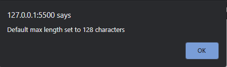
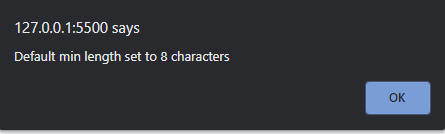
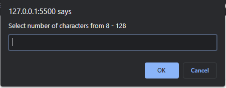
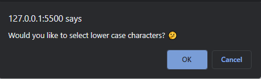
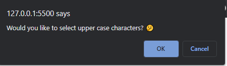
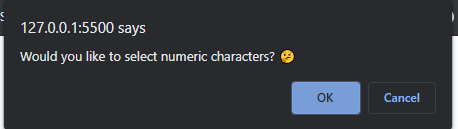
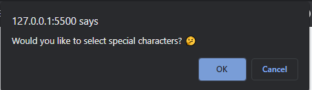

# 03-Password-Generator
## UWA Full Stack Flex Bootcamp - Feb 2021 by Jacob Hegan

[GitHub Repository](https://github.com/heganjr/03-PasswordGenerator-JH)

[Deployed URL](https://heganjr.github.io/03-PasswordGenerator-JH/)

_____________

## The Task
To create a password generator with a series of criteria where an arrary of characters at random will generate. This generator must meet the criteria based on what the user selects after "Generate Password" has been clicked. This criteria must be:

- The password is between 8 and 128 characters.
- if the user selects "Upper Case Characters" - the password has upper case characters present.
- if the user selects "Lower Case Characters" - the password has lower case characters present.
- if the user selects "Numeric Characters" - the password has numeric characters present.
- if the user selects "Special Characters" - the password has special characters present.

______
A prompt window is present that allows the user to select the character length of their generated password. If the value is less than 8 characters an alert will appear informing the user that the default minimum of 8 characters has been selected.

This is vice versa for the default maximum character length of 128 characters. an alert will appear informing the user that the default maximum of 128 characters has been selected.

The user will confirm with a confirm box, "Ok" or "Cancel", whether the password will contain the following:
- Uppercase characters
- Lowercase characters
- Numeric characters, and;
- Special characters.

Please note that ASCII decimal values have been used to generate the character arrays for the password generator ([ASCII Table](http://www.asciitable.com/)). From this a function has been created allowing the script to generate a low to high arrary then convert that array to characters with use of the String.fromCharCode method.

Due to the nature of probability selecting a smaller character length can lead to the one or more password criteria not showing in the in the Password Result

_______

## Screenshots

